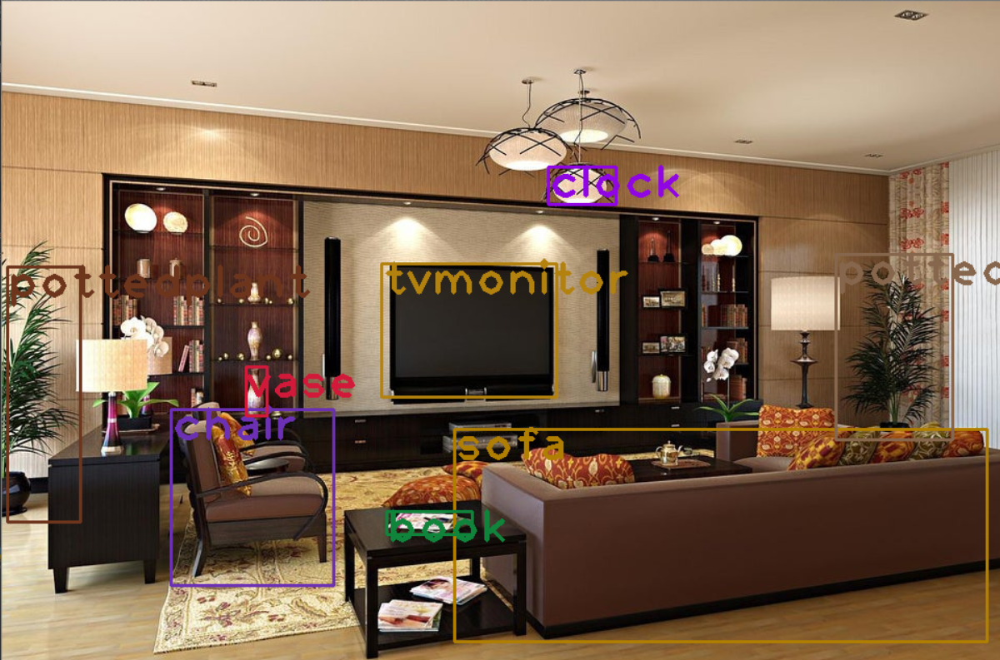
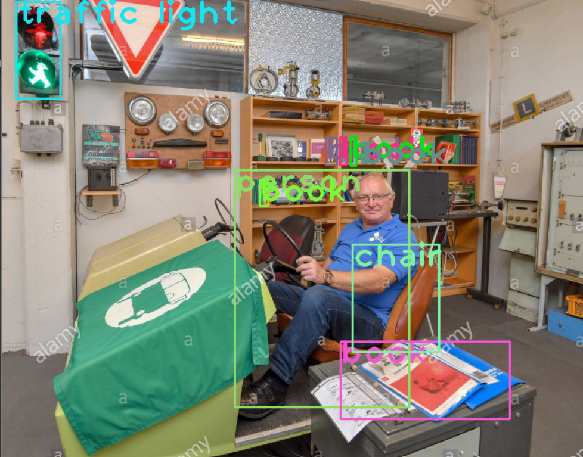

# YOLO_Object_Detection
YOLO Object Detection

## YOLO: Real-Time Object Detection
***
***You only look once (YOLO) is a state-of-the-art, real-time object detection system. On a Pascal Titan X it processes images at 30 FPS and has a mAP of 57.9% on COCO test-dev.***

 

Comparison to Other Detectors 
YOLOv3 is extremely fast and accurate. In mAP measured at .5 IOU YOLOv3 is on par with Focal Loss but about 4x faster. Moreover, you can easily tradeoff between speed and accuracy simply by changing the size of the model, no retraining required!

We do have 2 images and we have to detect objects 

and the detected objects are:

